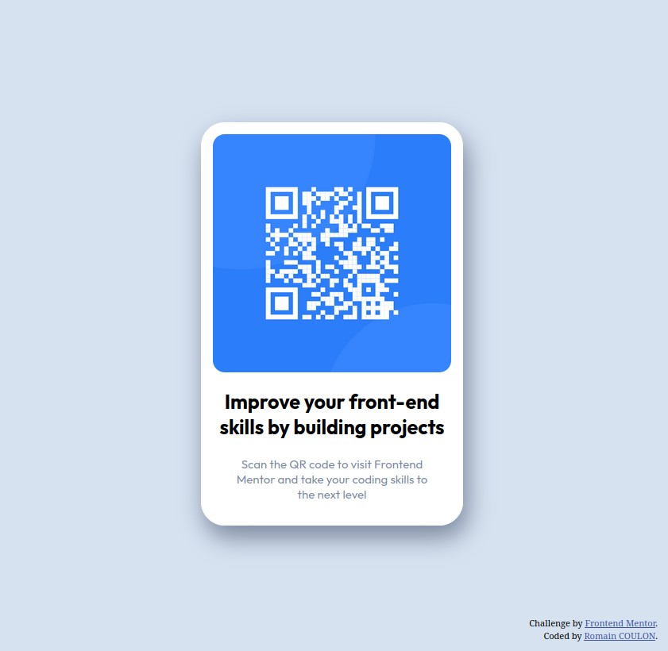

# Frontend Mentor - QR code component solution

This is a solution to the [QR code component challenge on Frontend Mentor](https://www.frontendmentor.io/challenges/qr-code-component-iux_sIO_H). Frontend Mentor challenges help you improve your coding skills by building realistic projects.

## Table of contents

- [Overview](#overview)
  - [Screenshot](#screenshot)
  - [Links](#links)
- [My process](#my-process)
  - [Built with](#built-with)
  - [What I learned](#what-i-learned)
- [Author](#author)

**Note: Delete this note and update the table of contents based on what sections you keep.**

## Overview

### Screenshot

### Links

- Solution URL: [Github Repository](https://github.com/Rcoulon44/FrontendMentor_QRCode_Challenge.git)
- Live Site URL: [Github Live Page](https://rcoulon44.github.io/FrontendMentor_QRCode_Challenge/)

## My process

### Built with

- Semantic HTML5 markup
- CSS custom properties
- Flexbox

### What I learned

It's my fisrt challenge on FrontEnd Mentor.
I learned basic css property (border radius, width, margin, padding) and flexbox.

## Author

- Website - [Romain COULON](https://github.com/Rcoulon44)
- Frontend Mentor - [@Rcoulon44](https://www.frontendmentor.io/profile/Rcoulon44)
